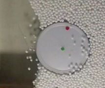

# Intrusion tracking in granular media / Color Object Tracking



The program must plot the behavior of the position, the angle of rotation, the linear and angular velocity of an intruder that penetrates a region filled with a confined granular medium.

## How to use

The color range by which colored objects are tracked throughout the video must be selected.

There are only two files:

- [tracking_fixed_vals.py](./tracking_fixed_vals.py)

    By using this file, the range values are already selected and the color abjects are tracked according to this range.

 ```py
 hsv = cv2.cvtColor(frame, cv2.COLOR_BGR2HSV) #Convert colors space

 # Blue range
 hMin_A=83
 sMin_A=138
 vMin_A=45
 hMax_A=114
 sMax_A=200
 vMax_A=255
 ```

- [tracking_gui_vals.py](./tracking_gui_vals.py)

    By using this file, the range values are selected by means of sliders in a GUI and the color abjects are tracked according to this range.

 ```py
  cv2.namedWindow('Blue')
  cv2.resizeWindow('Blue',500,300)
  cv2.createTrackbar('Hue Min','Blue',0,255,nothing)
  cv2.createTrackbar('Hue Max','Blue',0,255,nothing)
  cv2.createTrackbar('Saturation Min','Blue',0,255,nothing)
  cv2.createTrackbar('Saturation Max','Blue',0,255,nothing)
  cv2.createTrackbar('Value Min','Blue',0,255,nothing)
  cv2.createTrackbar('Value Max','Blue',0,255,nothing)


  while(1):

    hsv = cv2.cvtColor(frame, cv2.COLOR_BGR2HSV) #Convert colors space

    #get color range frome gui
    hMin_A = cv2.getTrackbarPos('Hue Min','Blue')
    hMax_A = cv2.getTrackbarPos('Hue Max','Blue')
    sMin_A = cv2.getTrackbarPos('Saturation Min','Blue')
    sMax_A = cv2.getTrackbarPos('Saturation Max','Blue')
    vMin_A = cv2.getTrackbarPos('Value Min','Blue')
    vMax_A = cv2.getTrackbarPos('Value Max','Blue')
 ```

There are three granular media videos. You have to select one of them.

```py
video = cv2.VideoCapture('videos/GOPR0656.MP4')
```

## Context of this project

This is my first repo, so I thought it would be appropiate to start with my first Python project back 2017, when I was an engineering student. I only made a small change to the code to resolve some compatibilities with [opencv-python 4.8](https://pypi.org/project/opencv-python/). I intend to upgrade it and work on it.
